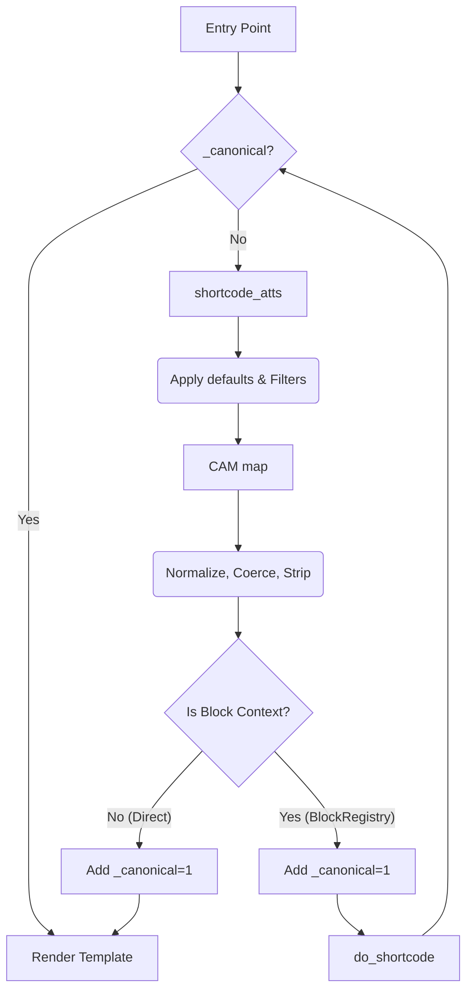

# V411 - Phase 3: Shortcode Layer Canonicalization (v1.1)

## 1. shortcode_atts() Policy: Option C (Authoritative Overrides)
To prevent drift while respecting third-party `shortcode_atts_{tag}` filters, we establish the following authoritative flow:

### The Flow:
1.  **Standard WP Step:** `shortcode_atts()` is called first. 
    - This applies `static::get_default_attributes()`.
    - This triggers `shortcode_atts_{tag}` filters, allowing third-party extensions to modify input.
2.  **Authoritative CAM Step:** Resulting array is passed to `CanonicalAttributeMapper::map()`.
    - CAM treats the filtered array as the new raw input.
    - **CAM is the final word:** It re-enforces the strict allowlist, re-applies SSOT defaults, and performs type coercion.
    - **Defaults Authority:** `AllowlistRegistry` is the authoritative source for defaults. If `get_default_attributes()` drifts, CAM will override with the registry value.
    - If a third-party filter adds an unknown attribute, CAM **strips** it in STRICT mode.

**Rationale:** This ensures that filters are respected but cannot break the "Single Source of Truth" integrity or the deterministic output requirement.

---

## 2. Guard Strategy: Execution Context & Attribute Hybrid
To handle nested shortcodes and recursion without complexity:

### Guard #1: Attribute Flag (`_canonical`)
- Remains on the attribute array as an internal guard.
- Prevents re-mapping the same attribute set thrice (Block -> Shortcode -> AbstractShortcode).
- Scope: Single shortcode execution.
- **Isolation Rule:** `_canonical` must be stripped before passing data to `prepare_template_data()` or the template layer.

### Guard #2: Static Execution Stack (Not Implemented)
- No static execution stack will be implemented in Phase 3. Attribute-level guard is sufficient by design.
- **Nested Handling:** If `[shortcode_a]` renders `[shortcode_b]`, `shortcode_b` will have ITS OWN `shortcode_atts()` and CAM call. This is NOT a double-map because the attribute sets are different.

---

## 3. Controlled Child Class Cleanup Policy
No "bulk delete". We adopt an **Audit-First** approach:

1.  **Phase A - Audit:** Identify child classes that manually use `Transformers` or `shortcode_atts` inside `prepare_template_data`.
2.  **Phase B - Parity Check:** Verify if CAM's global mapping covers the manual logic 1:1 (types, defaults).
3.  **Phase C - Diff-Based Removal:** Only remove if CAM provides 100% coverage.
4.  **Preservation:** If a child class has "non-schema" business logic (e.g., fetching DB data based on attributes), that logic **STAYS** in `prepare_template_data`.

---

## 4. Revised Architecture Pipeline (v1.1)

## 5. Safety Invariant: Wrapper Isolation
`CanonicalAttributeMapper` is strictly for **Shortcode Contracts**. 
Block-only attributes (`minWidth`, `maxWidth`, `height`) stay in `BlockRegistry`. CAM will log/strip them if they leak into the shortcode layer.
