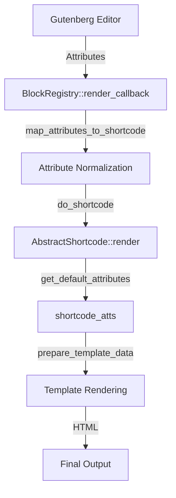

# Audit Report: v4.11.0 Shortcode-Block Surface Alignment

**Date:** 14.02.2026
**Scope:** Stage 1 - Inventory and Delegation Logic Verification
**Status:** COMPLETED

## 1. Executive Summary
This audit confirms that the MHM Rentiva v4.11.0 project maintains a 1:1 parity between Gutenberg Blocks and WordPress Shortcodes. All 19 shortcodes identified in `ShortcodeServiceProvider` have corresponding blocks in `assets/blocks/`. The delegation logic is centralized in `BlockRegistry`, which proxies block rendering to shortcodes, ensuring logic reuse.

## 2. Inventory Parity
| Component Group | Shortcode Tag | Gutenberg Block Slug | Status |
| :--- | :--- | :--- | :--- |
| **Reservation** | `rentiva_booking_form` | `booking-form` | ✅ Matched |
| | `rentiva_availability_calendar` | `availability-calendar` | ✅ Matched |
| | `rentiva_booking_confirmation` | `booking-confirmation` | ✅ Matched |
| **Vehicle** | `rentiva_vehicle_details` | `vehicle-details` | ✅ Matched |
| | `rentiva_vehicles_list` | `vehicles-list` | ✅ Matched |
| | `rentiva_featured_vehicles` | `featured-vehicles` | ✅ Matched |
| | `rentiva_vehicles_grid` | `vehicles-grid` | ✅ Matched |
| | `rentiva_search_results` | `search-results` | ✅ Matched |
| | `rentiva_vehicle_comparison` | `vehicle-comparison` | ✅ Matched |
| **Search** | `rentiva_unified_search` | `unified-search` | ✅ Matched |
| **Account** | `rentiva_my_bookings` | `my-bookings` | ✅ Matched |
| | `rentiva_my_favorites` | `my-favorites` | ✅ Matched |
| | `rentiva_payment_history` | `payment-history` | ✅ Matched |
| | `rentiva_messages` | `messages` | ✅ Matched |
| **Transfer** | `rentiva_transfer_search` | `transfer-search` | ✅ Matched |
| | `rentiva_transfer_results` | `transfer-results` | ✅ Matched |
| **Support** | `rentiva_contact` | `contact` | ✅ Matched |
| | `rentiva_testimonials` | `testimonials` | ✅ Matched |
| | `rentiva_vehicle_rating_form` | `vehicle-rating-form` | ✅ Matched |

## 3. Delegation Logic Analysis

The system utilizes a **Proxy-Delegation Pattern** to maintain parity:

### 3.1 Flow Diagram

### 3.2 Mapping Mechanism
- **Automated**: most attributes are transformed from `camelCase` (JS) to `snake_case` (PHP) via regex in `BlockRegistry.php`.
- **Manual Overrides**: `BlockRegistry::$aliases` handles non-standard mappings (e.g., `className` -> `class`).
- **Standardized Dimensions**: `minWidth`, `maxWidth`, and `height` are automatically mapped to a CSS-style container wrapper.

## 4. Identified Drift Hotspots
> [!WARNING]
> **Manual Mapping Drift:** Blocks like `vehicle-comparison` (L556) and `booking-form` (L572) have hardcoded alias overrides. If the shortcode attributes change in the PHP class, these must be manually updated in `BlockRegistry.php`.

> [!IMPORTANT]
> **Boolean Normalization:** Gutenberg saves booleans as true/false, but shortcodes often expect `"1"`/`"0"`. This is handled in `BlockRegistry::map_attributes_to_shortcode` (L602), but some older shortcodes might still expect string `"yes"`/`"no"`.

## 5. Metadata & Documentation
- `SHORTCODES.md`: **OUTDATED**. Missing `rentiva_messages` and some parameters for Transfer results.
- `UI_CONTRACTS.md`: **SYNCED**. Correctly describes the delegation contract.

## 6. Recommendations
1. **Automate Alias Discovery:** Move attribute mapping aliases from `BlockRegistry` into the individual Shortcode classes to keep the definition close to the usage.
2. **Standardize Booleans:** Ensure all shortcodes use `1/0` for boolean attributes to match the `BlockRegistry` normalization logic.
3. **Update Documentation:** Trigger a documentation update for `SHORTCODES.md` to include missing v4.11.0 attributes.

---
*Verified by Antigravity AI - Project MHM Rentiva Audit Suite.*
